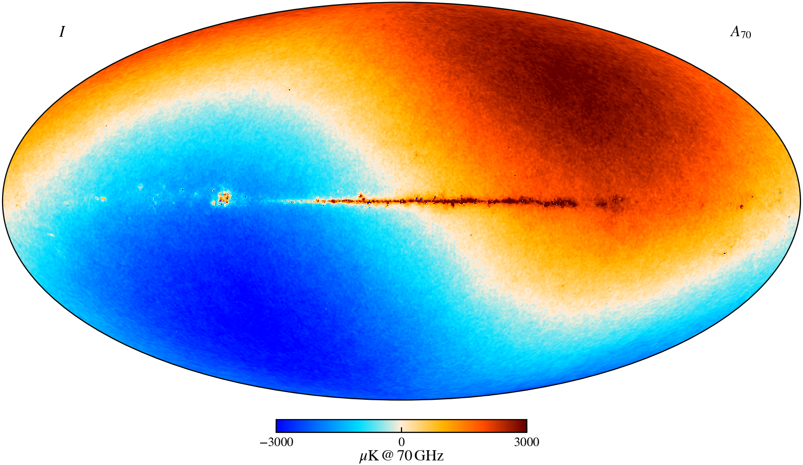

[](https://cosmoglobe.readthedocs.io/en/latest/?badge=latest)
[](http://www.astropy.org/)

<hr>

*cosmoglobe* is a python package that interfaces the **Cosmoglobe Sky Model** with **[Commander](https://github.com/Cosmoglobe/Commander)** outputs for the purpose of producing astrophysical sky maps.



## Features
See the **[documentation](https://cosmoglobe.readthedocs.io/en/latest/)** for amore comprehensive guide.

**Initialize Sky Model from Chain:** 
```python
import cosmoglobe

chain = cosmoglobe.get_test_chain() # Downloads a minimal Commander chainfile.
model = cosmoglobe.model_from_chain(chain, nside=256)
```

**Simulate the sky at 150 GHz in units of MJy/sr, smoothed to 40 arcmin with a gaussian beam:** 
```python
import astropy.units as u

emission = model(150*u.GHz, fwhm=40*u.arcmin, output_unit="MJy/sr")
```

**Integrate over a bandpass:** 
```python
import numpy as np
import healpy as hp
import matplotlib.pyplot as plt

# Reading in WMAP K-band bandpass profile.
bandpass_frequencies, bandpass_weights = np.loadtxt(wmap_bandpass.txt, unpack=True)

# The units of the detector must be specified even if the bandpass is pre-normalized.
bandpass_weights *= u.Unit("K_RJ") # Specify K_RJ or K_CMB
bandpass_frequencies *= u.GHz

model.remove_dipole() # Remove the dipole from the CMB component
emission = model(
    freqs=bandpass_frequencies, 
    weights=bandpass_weights, 
    fwhm=0.8*u.deg, 
    output_unit="mK_RJ",
)

hp.mollview(emission[0], hist="norm") # Plotting the intensity
plt.show()
```

## Installation
*cosmoglobe* can be installed via pip
```bash
pip install cosmoglobe
```

## Funding
This work has received funding from the European Union's Horizon 2020 research and innovation programme under grant agreements No 776282 (COMPET-4; BeyondPlanck), 772253 (ERC; bits2cosmology) and 819478 (ERC; Cosmoglobe).

<table align="center">
    <tr>
        <td></td>
        <td></td>
    </tr>
</table>

## License

[GNU GPLv3](https://github.com/Cosmoglobe/Commander/blob/master/COPYING)
